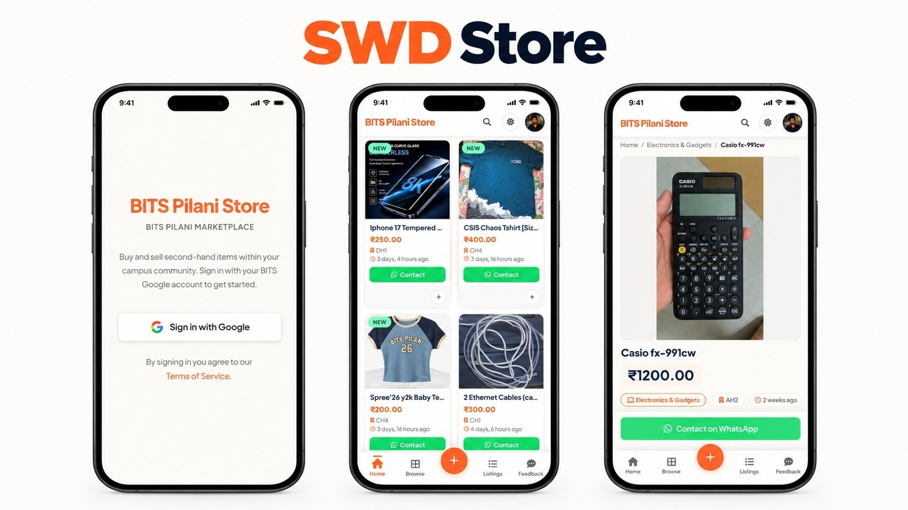
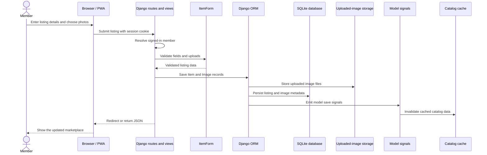

# SWD Store

<p align="center">
  <a href="https://swdstore.bits-pilani.ac.in">
    
  </a>
</p>

<p align="center"><sub>App preview mockup supplied by Ayush Sanger.</sub></p>

<p align="center">
  <strong>Built by Ayush Sanger and Vishrut</strong><br>
  Adopted as the <strong>official pawnshop store of BITS Pilani</strong>.
</p>

<p align="center">
  <a href="https://swdstore.bits-pilani.ac.in"><strong>Visit the live store ↗</strong></a>
  &nbsp;·&nbsp;
  <a href="#run-locally">Run it locally</a>
  &nbsp;·&nbsp;
  <a href="docs/architecture.md">Detailed architecture & UML</a>
</p>

<p align="center">
  
  
  
</p>

SWD Store is a campus marketplace where BITS Pilani students can browse and list pre-owned items, find listings by campus or hostel, and contact sellers directly.

## What you can do

- Browse, search, and filter marketplace listings.
- Create and manage listings with prices, locations, and multiple photos.
- Contact sellers through WhatsApp links.
- Sign in with Google and maintain a member profile.
- Submit feedback and browse read-only public JSON endpoints.
- Install the storefront as a Progressive Web App.

Optional integrations include Amazon SES email, Web Push notifications, Twilio phone lookups, and Celery background jobs.

## How it works — UML workflow



The full [architecture notes](docs/architecture.md) include component and domain-model diagrams, API entry points, and the scheduled-task flow.

## Run locally

### 1. Clone and install

```bash
git clone https://github.com/SangerForCode/SWD-Store.git
cd SWD-Store/pawnshop
python3.12 -m venv .venv
source .venv/bin/activate
python -m pip install --upgrade pip
python -m pip install -r requirements.txt
cp .env.example .env
```

### 2. Configure the environment

Set a fresh Django key in `pawnshop/.env`:

```bash
python -c "import secrets; print(secrets.token_urlsafe(50))"
```

Paste the generated value into `DJANGO_SECRET_KEY`. Google sign-in needs `GOOGLE_OAUTH_CLIENT_ID` and `GOOGLE_OAUTH_CLIENT_SECRET`; the app can start without the optional SES, Twilio, Web Push, or Redis settings. See `.env.example` for every supported variable. Do not reuse credentials from another deployment.

### 3. Prepare the database and start Django

```bash
python manage.py migrate
python manage.py createcachetable cache_table
python manage.py collectstatic --noinput
python manage.py check
python manage.py test
python manage.py runserver
```

Open <http://127.0.0.1:8000/>. To use the Django admin, first run `python manage.py createsuperuser`.

### Optional background jobs

The storefront works without Celery. To run the daily task that marks listings older than 60 days as sold, start Redis and run a Celery worker and beat process in separate terminals from `pawnshop/`:

```bash
redis-server
celery -A pawnshop worker --loglevel=info
celery -A pawnshop beat --loglevel=info
```

## Tech and project structure

- **Backend:** Django 5.1, Python 3.12 recommended
- **Data:** Django ORM with SQLite by default
- **UI:** Django templates, static assets, and an installable PWA shell
- **Background work:** Celery + Redis (optional)
- **Static files:** WhiteNoise

```text
SWD-Store/
├── docs/
│   ├── architecture.md
│   └── assets/swd-store-preview.jpg
└── pawnshop/
    ├── manage.py
    ├── .env.example
    ├── pawnshop/       # Settings, URL configuration, WSGI/ASGI, Celery app
    ├── bits/           # Models, views, APIs, forms, tasks, templates
    └── static/         # Source CSS, JavaScript, and app assets
```

## API and configuration

The Django URL configuration serves HTML pages, session-oriented `/api/...` routes, and read-only `/public/api/...` routes for items, categories, hostels, and campuses. Start with [`bits/urls.py`](pawnshop/bits/urls.py); handlers are in `bits/views.py` and `bits/public_views.py`.

All secrets and deployment-specific settings belong in the untracked `pawnshop/.env` file. The tracked `.env.example` contains placeholders only. The default database is local SQLite; uploaded media, generated static output, logs, and Celery state are runtime data and are intentionally excluded from Git.

## Credits and project status

Created by **Ayush Sanger and Vishrut** and adopted as the official pawnshop store of BITS Pilani. The live application is at [swdstore.bits-pilani.ac.in](https://swdstore.bits-pilani.ac.in).

This repository contains the application source, not a production deployment recipe. Review authentication, ownership checks, CSRF/CORS policy, upload handling, and production database/storage settings before deploying. Rotate any credentials that were used in older private copies. No `LICENSE` file is currently included, so no reuse or redistribution license is granted by this repository.
