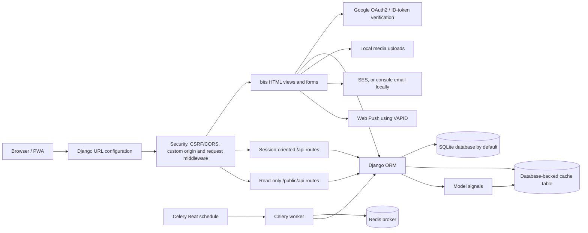
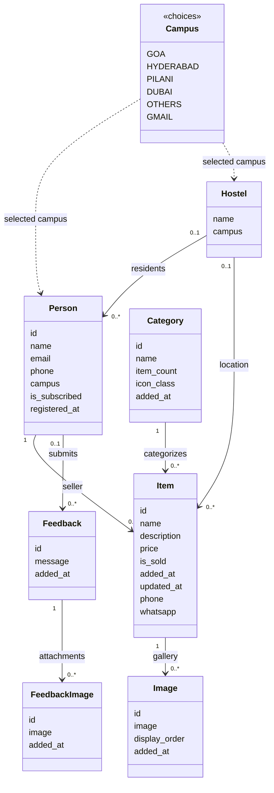
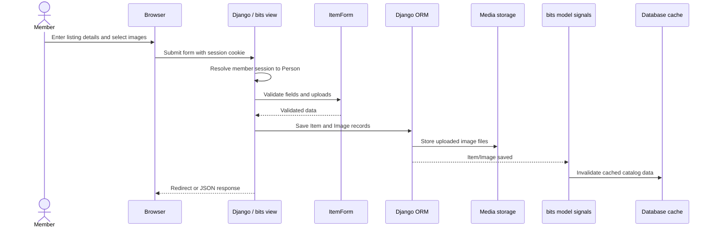

# Architecture and UML-style diagrams

The application has a Django project package (`pawnshop`) and a primary application (`bits`). The diagrams describe the source tree and configured integrations; optional services are shown even when not configured in a local `.env`.

## Components and request/data flow

## Domain model

`Person.save()` normalizes a stored phone number and derives the campus from a BITS email when possible. `Item.save()` normalizes its effective contact number, builds the WhatsApp link, and stores the absolute value of the price. Image rows use an explicit display order. These are model behaviors, not database-level constraints.

## Listing creation sequence

## Background task

Celery Beat schedules `bits.tasks.mark_old_items_as_sold` once a day at 09:11 in `Asia/Kolkata`. The task queries listings older than 60 days and marks them sold. Redis is the configured broker; starting the web server alone does not run this task.

## Entry points

- Project URLConf: `pawnshop/pawnshop/urls.py` — admin, allauth, PWA, app, and social-auth routes.
- App URLConf: `pawnshop/bits/urls.py` — pages and JSON endpoints.
- HTML/session views: `pawnshop/bits/views.py`.
- Public read-only endpoints: `pawnshop/bits/public_views.py`.
- Data model: `pawnshop/bits/models.py`.
- Scheduled task: `pawnshop/bits/tasks.py`.
- Model signal handlers: `pawnshop/bits/signals.py`.

The separate historical `bp_bot` utility and its spreadsheet/health-reading runtime data are intentionally not part of the public copy.
